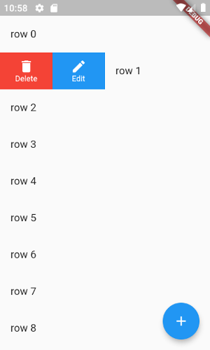
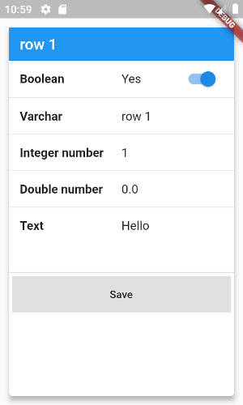

# Sqlview

[](https://pub.dartlang.org/packages/sqlview)

A collection of sql views for Sqlite and Flutter using [Sqlcool](https://github.com/synw/sqlcool). Available views:

- **Admin view**: full admin interface for add/edit/delete rows in a table
- **Infinite list view** from a table

## Crud admin view

List of rows | Edit row
------------ | --------
 | 

To get the above use an Sqlcool database with a defined schema:

   ```dart
   import 'package:sqlcool/sqlcool.dart';

   var table = DbTable("item")
      ..boolean("boolean", defaultValue: false)
      ..varchar("varchar")
      ..integer('integer_number', defaultValue: 1)
      ..real("double_number", defaultValue: 0)
      ..text("text", defaultValue: "");

   var db = Db();
   db.init("db.sqlite", schema = [table]);
   ```

Then use it in a widget:

   ```dart
   import 'package:flutter/material.dart';
   import 'package:sqlcool/sqlcool.dart';
   import 'package:sqlview/sqlview.dart';

   class _CrudPageState extends State<CrudPage> {
      SelectBloc bloc;

   @override
   void initState() {
      bloc = SelectBloc(database: db, table: "item");
      super.initState();
   }

   @override
   Widget build(BuildContext context) {
      return Scaffold(
         body: CrudView(bloc: bloc, nameField: "varchar"),
         floatingActionButton:
            CrudAddActionButton(db: db, schema: db.schema.table("item")),
         );
      }
   }

   class CrudPage extends StatefulWidget {
      @override
      _CrudPageState createState() => _CrudPageState();
   }
   ```

## Infinite list view

   ```dart
   InfiniteListView(
      db: db,
      table: "product",
      limit: 15,
      orderBy: "name",
      itemsBuilder: (context, item) {
         return ListTile(
            title: Text(item['name']), trailing: Text(item["price"]));
      });
   ```